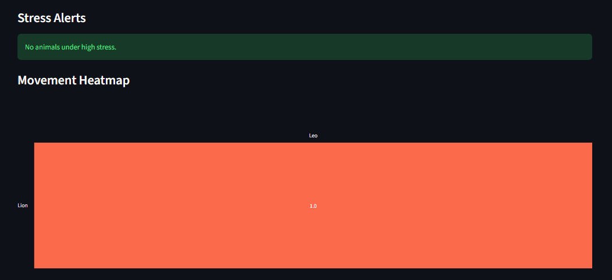
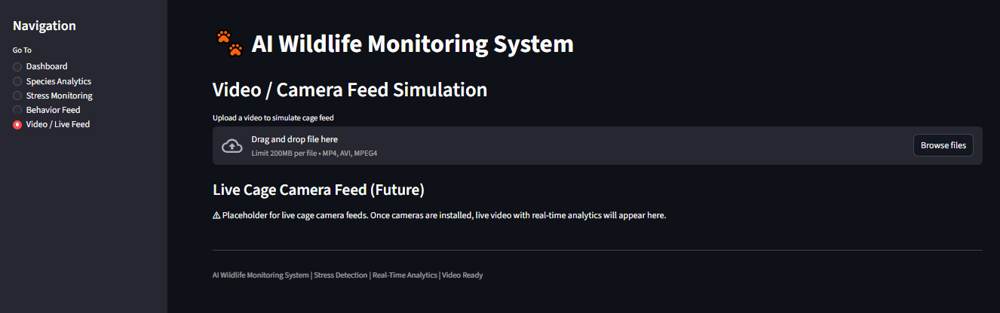

# 🐾 AI Wildlife Monitoring System

A **real-time wildlife monitoring and analytics system** built with **Streamlit** for the frontend and **Flask + MySQL** for the backend. This system tracks animal stress, health, behavior, and provides analytics for wildlife monitoring centers or zoos.

---

## Features

- **Dashboard Overview**
  - Total animals, healthy/sick animals, total enclosures
  - Species distribution (pie chart)

- **Species Analytics**
  - Bar chart of animals per species

- **Stress Monitoring**
  - Animal stress logs
  - Stress alerts for high-risk animals
  - Heatmap of stress/movement
  - AI anomaly detection for unusual behavior

- **Behavior Feed**
  - Live behavior logs
  - Stress timeline visualization

- **Video / Live Feed Simulation**
  - Upload videos to simulate cage feed
  - Placeholder for live camera feed integration
  - YOLO detection support (future)

---

## Installation

1. **Clone the repository**

```bash
git clone https://github.com/MuhammadShayan8401/AI-Wildlife-Monitoring-System.git
cd AI-Wildlife-Monitoring

🧪 Try Video Upload Analytics

You can upload sample wildlife footage (or zoo videos) in the Video / Live Feed tab.
This will simulate YOLO detection and display stress analytics.

🛠 Future Work

🚀 Live camera feed integration from enclosure CCTV
🚀 Real-time stress prediction models
🚀 Advanced YOLO animal recognition
🚀 Mobile browser friendly dashboard
🚀 Deployment with Docker / Kubernetes

📜 License

This project is licensed under the MIT License — feel free to use and improve!

📊 Demo Screenshots
)
,
)
)
![Video / Camera Feed Simulation])

📬 Contact

Muhammad Shayan Ahmed
SSUET ’27 | Wildlife AI | Software Engineer
📧 (m.shayan.8401@gmail.com)
🔗 https://github.com/MuhammadShayan8401