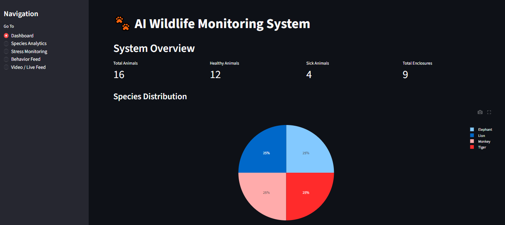
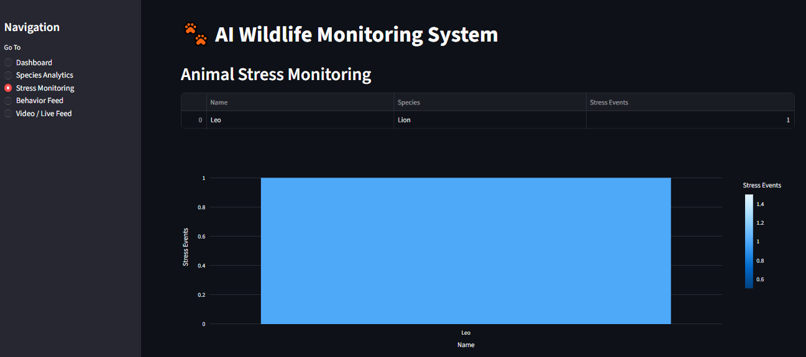
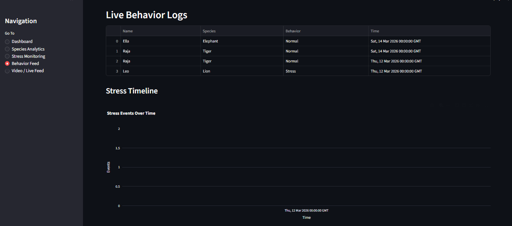
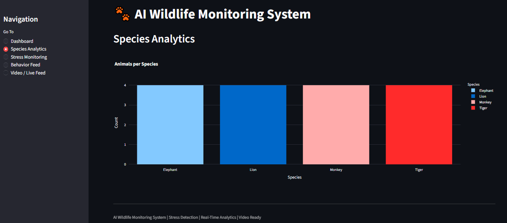

# 🐾 AI Wildlife Monitoring System

A **real-time wildlife monitoring and analytics system** built with **Streamlit, Flask, and MySQL**.  
The platform helps wildlife parks, zoos, and conservation centers monitor **animal health, stress behavior, and activity patterns** using data analytics and AI-ready architecture.

---

# 🎯 Features

## 📊 Dashboard Overview
- Total animals overview
- Healthy vs sick animals
- Total enclosures
- Species distribution visualization

## 🐾 Stress Monitoring
- Detect animals showing unusual stress behavior
- Stress event logs
- High-risk stress alerts
- Stress heatmap visualization

## 📈 Species Analytics
- Species population distribution
- Interactive charts and analytics
- Wildlife population insights

## 🧠 Behavior Monitoring Feed
- Live behavior logs
- Stress timeline visualization
- Activity tracking

## 🎥 Video / Live Feed Simulation
- Upload wildlife videos
- Simulate cage camera feed
- Ready for **YOLO object detection integration**

---

# 🏗 System Architecture
Camera Feed / Behavior Logs
│
▼
Flask API Layer
│
▼
MySQL Database
│
▼
Streamlit Dashboard
│
▼
AI Analytics & Alerts

---

# 🛠 Tech Stack

| Layer | Technology |
|------|-------------|
| Frontend | Streamlit |
| Backend | Flask |
| Database | MySQL |
| Visualization | Plotly |
| Computer Vision | OpenCV |
| AI Integration | YOLO (future integration) |

---

# 📁 Project Structure
AI-Wildlife-Monitoring-System
│
├── app.py
├── config.py
├── db.py
├── requirements.txt
├── streamlit_run.py
│
├── routes
│ ├── animals.py
│ ├── enclosures.py
│ ├── feeding.py
│ ├── health.py
│ ├── behavior.py
│ ├── behavior_logs.py
│ ├── dashboard.py
│ ├── alerts.py
│ ├── health_risk.py
│ └── stress_monitor.py
│
├── screenshots
│ ├── dashboard.png
│ ├── stress.png
│ ├── behavior.png
│ ├── species.png
│ └── video.png
│
└── videos ###future Integration

---

# ⚙️ Installation

## 1️⃣ Clone the Repository
git clone https://github.com/MuhammadShayan8401/AI-Wildlife-Monitoring-System.git

cd AI-Wildlife-Monitoring-System

## 3️⃣ Install Dependencies

pip install -r requirements.txt

---

# 📊 Demo Screenshots

## Dashboard

## Stress Monitoring

## Behavior Feed

## Species Analytics

## Video Feed Simulation

---

# 🧪 Example Use Cases

This system can be used by:

- Zoos
- Wildlife parks
- Animal rehabilitation centers
- Wildlife research labs
- Conservation organizations

---

# 🚀 Future Improvements

Planned enhancements:

- Live cage camera feeds
- YOLO animal detection
- AI-based stress prediction
- Mobile-friendly dashboard
- Cloud deployment
- Machine learning behavior prediction

---

# 👨‍💻 Author

**Muhammad Shayan Ahmed**

Software Engineering Student  
SSUET '27  

Interests:
- Artificial Intelligence
- Data Analytics
- Wildlife Technology
- Computer Vision

GitHub:  
https://github.com/MuhammadShayan8401  

Email:  
m.shayan.8401@gmail.com

---

# ⭐ Support

If you like this project, please consider giving it a **star ⭐ on GitHub**.

---

# 📜 License

MIT License  
Free to use for research and educational purposes.